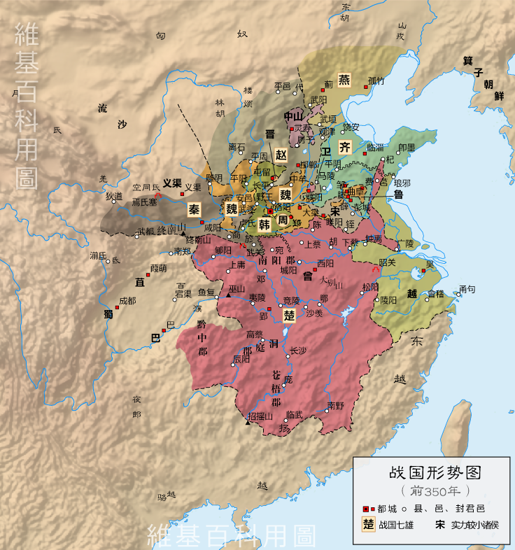

Title: Quick thoughts on Debt: The First 5000 Years
Date: 2021-09-21 18:00
Modified: 2010-12-05 18:00
Category: Books-Review
Tags: anthropology, economics-history, english, books-review
Slug: debt_greueber
Authors:  イルファン
Summary: Some quick thoughts on "Debt: The First 5000 Years" by David Graeber (2012)

I have spent some time reading this book from the point of view of an undergraduate economist. The main takeaway from this book is that debt comes earlier to humanity than money. The first writing in Sumeria, before they begin to exult gods and kings and stories of their cultures, was about resources retained and distributed by the central authorities - temples and palaces - and physical transactions between citizens of the city. Writing comes from the need for humans to properly tally their gifts and debts, and to distribute produces and natural resources from one part of the state - farmers and artisans - to the other, e.g. scribes and soldiers. 

This takeaway is the central thesis of this book. There was never barter system in "primitive" human societies. Barters are done between friendly enemies and untrusted strangers. Why do us moderns get the impressions of barters' universality before currency? Because when the first modern explorers write about their experiences with native cultures all over the world, they are untrusted strangers and so the natives refuse to transact with them except with barters. This can also be seen in the accounts of Ancient Greeks, who when they first come up to strange new shores all along the Mediterranean Sea, needed to barter ceramic vases and wines with fur and slaves. Because other types of transactions require trust and history which in the absence of precious-metal backed specie or central authorities, are done through cultures.

Graeber don't really focus on more primitive cultures, but other anthropologists such as Flannery and Marcus argued in their book "The Creation of Inequality: How Our Prehistoric Ancestors Set the Stage for Monarchy, Slavery, and Empire" (2014) that inequality stems from prehistoric societies' acceptance of debt and prestige-seeking gif	ting. Pre-agriculture Northwest American tribes managed to produce enough surplus from fishing to support elites that competed with one another for prestige from feasting, gifting, and warmaking. This trend also occurs in Africa, where a few hunter-gatherer tribes like the Khoi-San moved from equality between hunters to inequal rich headmen-dominated by adopting cattle-raising and farming from neighbours. It seems with the adoption of food-producing technology came the incentives for a family of "big men" to save assets, gift or give loans to neighbours that are unlucky, and get prestige or debt peonage that come after that. 

Bret Deveraux (2020) in [Acoup Blog Bread: How did they make it, Part II Big Farms] (https://acoup.blog/2020/07/31/collections-bread-how-did-they-make-it-part-ii-big-farms/) argues that inequality and concentration of wealths into a small percentage of "big men" large landowners is the result of more and more innovation of farming technologies through the ages that make large farms with more workers more economically profitable than small farmers that became stuck as subsistence farmers or serfs. The technologies include 'oxen-drawn plows, manure, reestabilishing marginal farming lands as pasture, and infrastructures and tools of agriculture". This lead to smaller farmers seeking help from large landowners that needed to be repaid in-kind through labour or through goods, the invention of debts. His examples are tenant labors of Roman coloni and medieval feudal manorial estates, but I would argue the same tendency can be readily seen in early agricultural city-states of Mesopotamia and Egypt. 

Moving on, Graeber introduces the idea that cash money was invented after the 7th century due to the need to pay soldiers. In the Near East, Lydian kingdom which casted the first electrum-copper coinage in Magnesia paid Greek mercenaries from Ionia and mainland Greece, which soon spread everywhere in the Sea. In China, the first gold coins were minted by the State of Chu, which tried to dominate China by annexing other states. The first Indian called Karshapana was produced in Eastern India, and seems to be used by merchants and bankers rather than the state. However, it is interesting to note that both pre-coinage Zhou China and Vedic India seemed to use cowries' shells as their unit of accounts, in contrast to Mesopotamian usage of liters of barleys as the unit of account. In my opinion, cowry shells (貝 in Kanji) has already been used as currency in many different societies - indeed, Flannery and Marcus showed case studies of a few different hunter-gatherer tribes who use cowry shells or an analogue as special gift-items, for example for dowry-prices or blood money (other cultures used, e.g., cattles, camels, or in the case of early Medieval Ireland, women slaves).

(China in the Years of Spring of Autumn period, 350BC. State of Chu is the largest power in central China (楚) By 玖巧仔 (C) Creative Commons Attribution-Share Alike 3.0 Unported license)

In the next sections, Graeber advanced a cycle of coinage and debts as the main transaction oil of global civilization. As mentioned, in Bronze Age states used central ledgers stored in temples to validate transactions and debts between citizens. In the Iron Age, states leave the market to validate these transactions through coinage. In the early Medieval era, European kingdoms seem to lack the coinage necessary and returned to tallies and debts recorded by local monks and churches - though Dar-'al Islam still use dinar and dirham even with the invention of international banking-alike financial networks of non-interest-bearing instruments. Later on, during the Age of Exploration, European colonial empires conquered a lot of gold and silver in the New World, and also bypassed the Silk Road to come directly to the spice islands and China through the global ocean. This led to the usage of coinage in daily use, even as warfare becomes more and more destructive until World War 2. Next, came the discontinuation of precious-metal backed specie.

In the modern world, fiat money is not backed by precious metal like it did for the last two and a half millenium. Indeed, money supply is very much of a highly active study by nations due to its importance to the economy, for example velocity of money or inflation. Nowadays too, many people have their money not in the form of fiat currency, but as numbers in ledgers of banks or other financial industries. As Graeber argues, this phenomenon wasn't unprecenteded in history. Indeed, the first historical society of Mesopotamia worked like this all the way until Alexander's conquest in 310 BC. 

As a conclusion, "Debt: The First 5000 Years" is a very interesting book. I can wholly recommend it to anyone interested in the usages of debts and coinages by historic states all the way until the modern age. There are some arguments that I think can be strengthened by looking towards other historical states or "primitive" cultures studied by modern anthropologists. For example, the use of cowry shells and other analogues as currency seem to occur in prehistory and many extant cultures. However, the fact that debt and currency came to us all the way from prehistory - or even before the Neolithic Revolution - is a very huge idea and I implore readers to get a copy of this book at least for a one-time read.

Thank you for reading this review,
Irfan Nurhadi Satria (2021)

This review is licensed under [CC BY-SA 2.0] (https://creativecommons.org/licenses/by-sa/2.0/)
